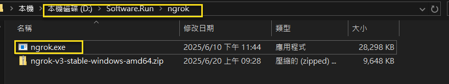
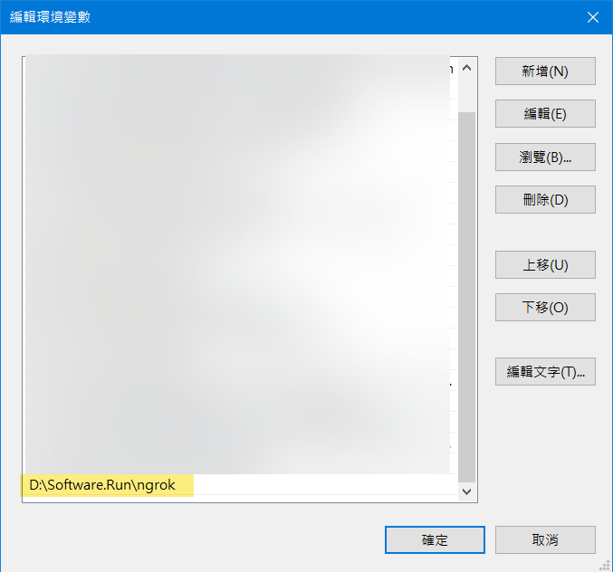
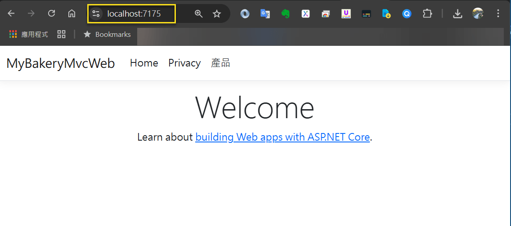

# 如何使用 ngrok 由外部連入本機網站

## 前言

最近有需要由外部連至某位同仁的筆電進行測試的需求, 目前最常用的服務是 ngrok, 它會給一個外部的網址, 當使用者輸入那個外部網址時, 會導向那位同仁筆電上的網站.  

查了一下各個網誌的寫法, 看來似乎很簡單; 但實際走過一遍, 還是有一些坑要小心.  

以下係以筆者 <a href="https://www.jasperstudy.com/2024/02/aspnet-mvc-aspnet-core-mvc.html" target="_blank">ASP.NET MVC 及 ASP.NET Core MVC 的錯誤處理</a> 這篇文章的網站作為範例.  

<!-- more -->

## 下載

- 下載連結: 
  - https://ngrok.com/downloads/windows?tab=download 

## 安裝

直接解壓縮即可.  

  

## 環境變數設定

設定 PATH 環境變數.  

  

## 實測

### 在本機以 VS2022 執行一個 Web 應用程式 [Ctrl + F5]

由以下可看到有 2 個 連結:
- https://localhost:7175
- http://localhost:5226 

```plaintext
info: Microsoft.Hosting.Lifetime[14]
      Now listening on: https://localhost:7175
info: Microsoft.Hosting.Lifetime[14]
      Now listening on: http://localhost:5226
info: Microsoft.Hosting.Lifetime[0]
      Application started. Press Ctrl+C to shut down.
info: Microsoft.Hosting.Lifetime[0]
      Hosting environment: Development
info: Microsoft.Hosting.Lifetime[0]
      Content root path: ....
```
 
### 本機實測頁面

  


### ngrok 認證及授權 (本機電腦只需作一次即可)

必須要在 ngrok 註冊帳號, 並取得 token, 才能在本機啟動 ngrok.

- 建立帳號
	- https://dashboard.ngrok.com/signup
- 取得 token 
	- https://dashboard.ngrok.com/get-started/your-authtoken
- 複製 token
	- <your_token>
- 在本機下指令
	- ngrok config add-authtoken <your_token>
		- ex: ngrok config add-authtoken asdfaefalkjkjlkajijlkj
	- 執行後, 會將 token 存放至本機的檔案: 
		- %USERPROFILE%\AppData\Local\ngrok\ngrok.yml


### 啟動 ngrok

通常啟用 http 就可以了, 這個最簡單; 但如果有 redirect 為 https 的話, 請改用 https 的方式.

- 如果您的本地服務是 http://，您可以只寫連接埠號碼。
	- ngrok http 5226
- 如果您的本地服務是 https://，您必須寫上完整的 https:// 位址。
	- ngrok http https://localhost:7175
	
  


### 透過 ngrok 連入本機

出現這個頁面, 只要按 [Visit Site] 即可.

  

  


## 常用連結

由於整個過程, 有發生一些狀況, 故將連結整理如下: 

### 障礙排除

執行完 ngrok http 5226 後, 整個 command prompt 閃退.

此時, 只能到以下連結停掉服務.
- https://dashboard.ngrok.com/agents 

  

### 狀態查詢

本機 ngrok 狀態檢視 (在 ngrok service 有啟動的狀況下) 
- http://localhost:4040/ 

   


